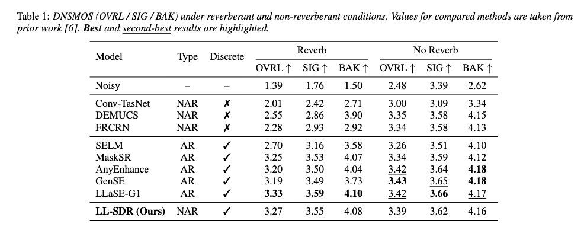

# LL-SDR: Low-Latency Speech Enhancement via Discrete Representations

This repository contains training and inference scripts
for the LL-SDR, a Low-Latency Speech Enhancement Method, introduced in the paper titled **LL-SDR: Low-Latency Speech Enhancement via Discrete Representations**.

paper link to be released <br>
📈[Demo Site](https://jingyi49.github.io/demo_SE/)<br>
⚙[Model Weights](https://huggingface.co/jingyi49/llsdr)

👉 **Low Latency:** Our model achieves **real-time factor (RTF) = 0.0108**, enabling extremely low-latency speech enhancement suitable for real-time applications.<br>
💪 **Robustness:** Our model performs well in both **reverberant** and **non-reverberant** acoustic conditions.<br>


## Usage

### Installation
```
pip install -r requirements.txt
```

### 🤗 Weights
Weights are available at: [huggingface](https://huggingface.co/jingyi49/llsdr)
The released model supports **16 kHz audio**. Using this weight, you can reproduce the results reported in our experiments on the DNS-Challenge 2020 testset.


### Inference

Before running inference, open `infer.py` and set the following paths according to your setup:

- `model_path` – path to the pretrained model weights  
- `scp_file` – path to the input audio list or manifest  
- `output_dir` – directory where enhanced audio will be saved  

Then run:

```bash
python infer.py
```

This will create `.wav` files with the same name as the input files.


## Training

The model can be trained using the following commands.

### Pre-requisites

Please replace the `audiotools/data/datasets.py` file in your environment with the `datasets.py` provided in this repository.

### Dataset Structure

The filenames in the noisy and clean directories must match. Example:
```
train_clean/
1.wav
2.wav
3.wav

train_noisy/
1.wav
2.wav
3.wav
```
- `train_clean/` contains the clean reference audio.  
- `train_noisy/` contains the corresponding noisy audio files.  
- Make sure that the filenames are identical in both directories.

Before training, open `conf/prop.yml` and update the dataset paths:

```yaml
train:
  build_dataset:
    folders: /path/to/your/train_clean_and_noisy
```


### Single GPU training
```
export CUDA_VISIBLE_DEVICES=0
python scripts/train.py --args.load conf/ablations/proposed.yml --save_path runs/llsdr/
```

### Multi GPU training
```
export CUDA_VISIBLE_DEVICES=0,1
torchrun --nproc_per_node gpu scripts/train.py --args.load conf/ablations/proposed.yml --save_path runs/llsdr/
```

## Testing
You can test with dnsmos.py. The testset is at [DNS Challenge Interspeech 2020 blind_test_set](https://github.com/microsoft/DNS-Challenge/tree/interspeech2020/master/datasets/blind_test_set)
```
python dnsmos.py
```

## Results

<p align="left">
</p>

## Acknowledgement
We would like to thank the authors of [descript-audio-codec
](https://github.com/descriptinc/descript-audio-codec) for open-sourcing their code, which inspired our work.
